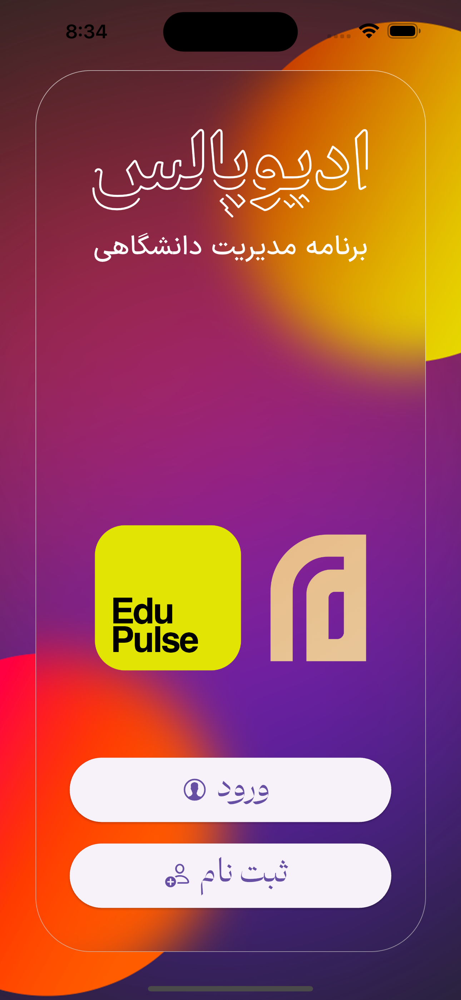
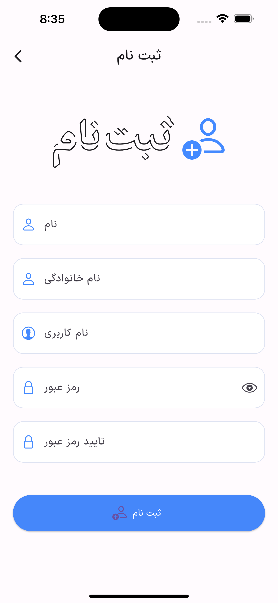
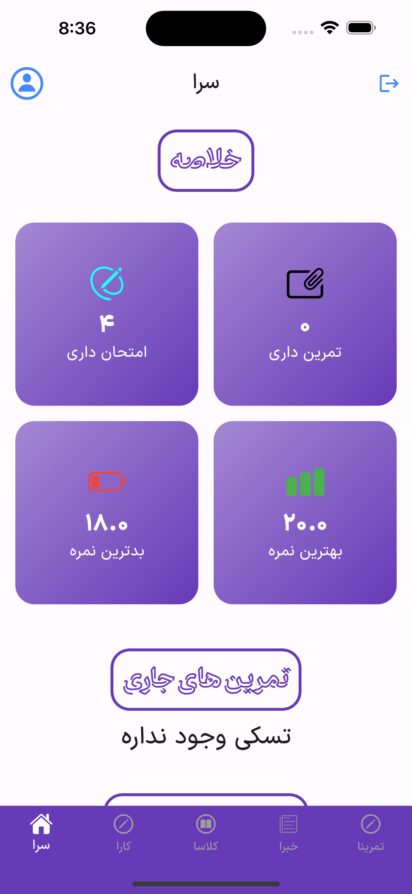
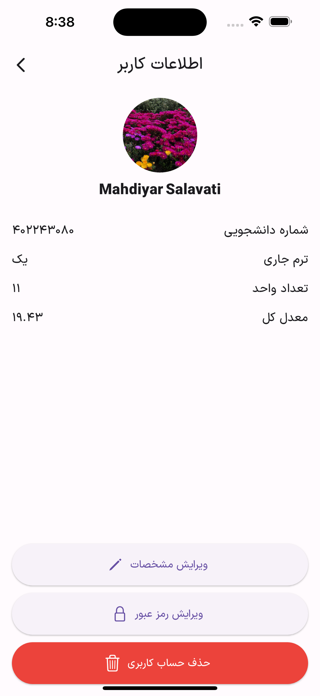
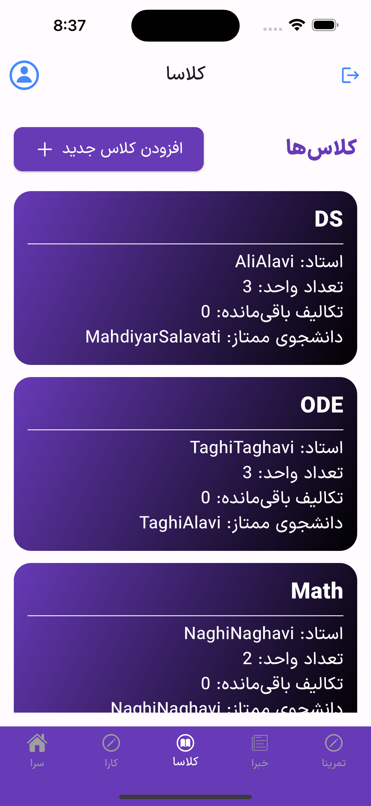

# EduPulse
(SBU AP Project Spring 2024)


## Overview

EduPulse is a university management system comprising a console-based Java server application and a Flutter app. The app supports iOS devices and communicates with the Java server via sockets to manage operations effectively.

## Features

- Manage teachers, students, courses, assignments, and projects through the terminal.
- Real-time synchronization between the Flutter app and Java server.
- Optimized for iOS devices.
- The Flutter app includes a built-in to-do list with local notifications for tasks and assignments.
- Users can select and send assignment files directly through the app.

## Getting Started

### Requirements

- Java Development Kit (JDK) 8 or higher
- Flutter SDK
- A terminal or command prompt

### Installation

1. **Clone the repository:**
    ```sh
    git clone https://github.com/mahdiyarsalavati/EduPulse
    ```

2. **Navigate to the Backend directory:**
    ```sh
    cd Backend
    ```

3. **Compile and run the Java server:**
    ```sh
    javac BackendServer.java
    java BackendServer
    ```

4. **Navigate to the Flutter app directory:**
    ```sh
    cd lib
    ```

5. **Run the Flutter app:**
    ```sh
    flutter run
    ```

## Usage

1. **Run the Backend Java Server:**
   Ensure the Java server is running before starting the Flutter app to establish a socket connection.

   
2. **Run the Flutter App:**
   Use the Flutter app on your iOS device or simulator to interact with the server. The app provides an intuitive interface for managing university operations.

   

3. **Terminal Operations:**
   In the terminal using CLI.java, teachers and admins can add or remove courses, students, and assignments.

## Screenshots

<div style="display:flex; justify-content:space-between; align-items:center;">
   
   
   
   
</div>

## Contact

Mahdiyar Salavati - [mahdiyarultra@gmail.com](mailto:mahdiyarultra@gmail.com)
